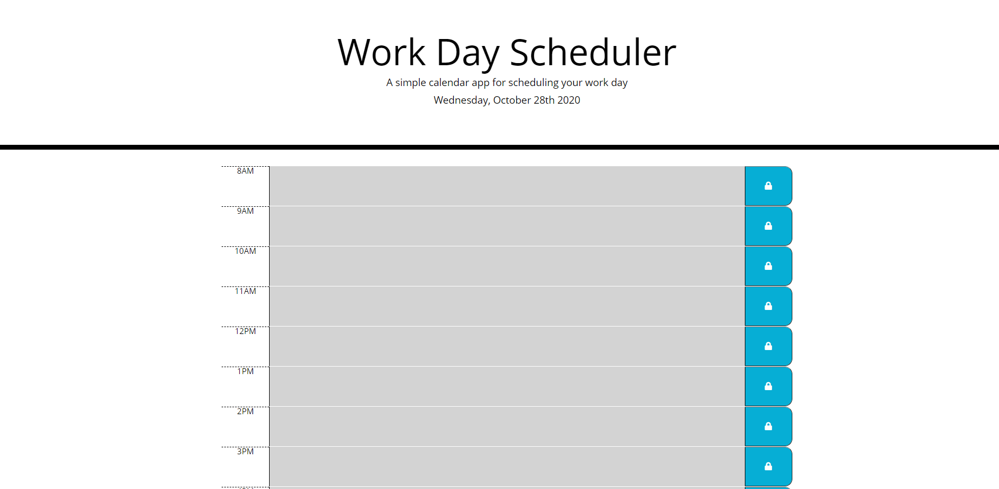

# Work-Day-Scheduler

## Description 

The task that I was given was to create a functional schedule for a work day. The client wants a website that can add and save important events in a daily planner. The functionality of the scheduler is as follows:

1. The current date is displayed
2. There are one hour time blocks for standard business hours
3. The time blocks are colour-coded to indicate whether it is in the past,present, future.
4. Within each time blocks, there is a field to enter events and a button to save the events. 
5. The saved events are displayed even if the page is refreshed.

In this project, I used javascript with jQuery API to code the functionality of the scheduler. The index.html and styles.css files were already provided.

The Work Day Scheduler website looks like:

Link to the Github repository: https://https://github.com/akwanmtl/Work-Day-Scheduler/

Link to the website: https://akwanmtl.github.io/Work-Day-Scheduler/

## Credits

* [License badge link](https://gist.github.com/lukas-h/2a5d00690736b4c3a7ba)
* [jQuery Quick API Reference](https://oscarotero.com/jquery/)

## License

Copyright (c) [2020] [Annie Kwan]
